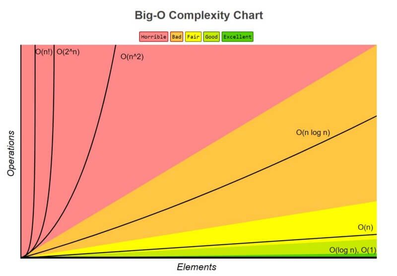
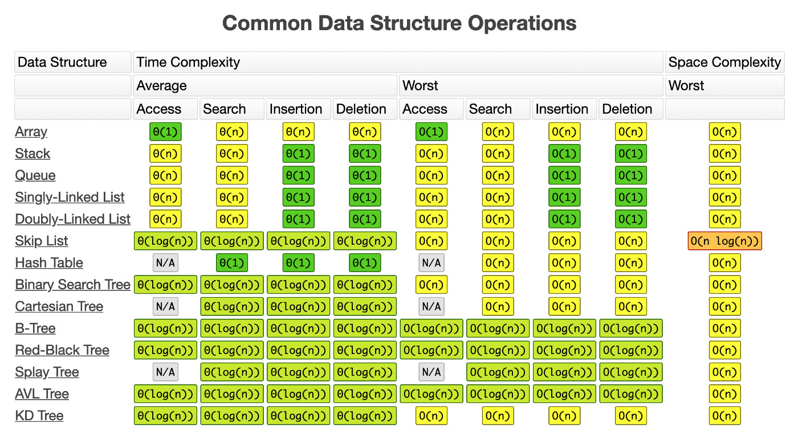

# Time Complexity (Big-O Notation)

[[toc]]

## Resources

- [Explained with Python](https://towardsdatascience.com/understanding-time-complexity-with-python-examples-2bda6e8158a7)
- [Explained Simply](https://dzone.com/articles/learning-big-o-notation-with-on-complexity)
- [Visual Representations](https://www.bigocheatsheet.com/)

## Definitions

**Space Complexity**: amount of memory space required to solve a problem in relation to the input size. 

**Time Complexity**: the amount of time it takes to run an algorithm.

Big O Notation is a relative representation of the **complexity** of an algorithm which describes how it performs, scales and the upper bounds of its growth rate.



Ordering of complexity from lowest to highest:

| Complexity 	        | Name 	             |    |
|---	                |---	             |---
| O(1) 	                | Constant 	     |:large_blue_circle:   |
| O(log n) 	        | Logarithmic 	     |:large_blue_circle:   |
| O(n) 	                | Linear 	     |:large_orange_diamond:|
| O(n log n) 	        | Linear Logarithmic |:large_orange_diamond:|
| O(n<sup>2</sup>) 	| Quadratic 	     |:red_circle:          |
| O(n<sup>3</sup>) 	| Cubic 	     |:red_circle:          |
| O(2<sup>n</sup>) 	| Exponential        |:red_circle:          |

Data structures and their operations association compexlity:



## Time Complexities

### O(1) - Constant Complexity :large_blue_circle:

A function that always takes the same take regardless of input **size**.

Has the least complexity and considered as good as it can get.

For example, the below will *not* increase with complexity with a larger list of items.

```python
def first_element_squared(items: list[int]) -> int:
     return items[0] * items[0]
```

### O(log n) - Logarithmic Complexity :large_blue_circle:

A function whose complexity increases logarithmically as the input size increases.

So if it takes 1 second to compute 10 elements, it will take 2 seconds to compute 100 elements.

This makes O(log n) functions scale very well so that the handling of larger inputs is much less likely to cause performance problems.

A good example of this is divide and conquer type of logic like binary search or quick sort.

```python
def binary_search(alist: list[int], item: int) -> bool:
   first = 0
   last = len(alist)-1
   found = False

   while first <= last and not found:
       midpoint = (first + last)//2
       if alist[midpoint] == item:
           found = True
       else:
           if item < alist[midpoint]:
               last = midpoint-1
           else:
               first = midpoint+1

   return found
```

### O(n) - Linear Complexity :large_orange_diamond:

It is linear if the steps required to complete the execution of an algorithm increase or decrease linearly with the number of inputs.

For example, below we have a list of numbers to check, the complexity and time taken will entirely depend upon the length of the numbers list.

```python
def list_has_one(numbers: list[int]) -> bool:
    for number in numbers:
         if number == 1:
	     return True
     return False
```

### O(n log n) - Quasilinear Complexity :large_orange_diamond:

A function where each operation in the input data have a logarithmic time complexity.

Simply put, its an function that calls logarithmic complex function.

For example, a function that calls a binary search function on each input:

```python
def search_all(data: list[list[int]], item: int) -> list[bool]:
    results = []
    for numbers in data:
        results.append(binary_search(numbers, item))
    return results
```


### O(n<sup>2</sup>) - Polynomial Complexity :red_circle:

A function whose complexity is directly proportional to the square of the input size (using Quadratic examples). 

For example, we use a nested loop to iterate over the same list:

```python
def get_combinations(numbers: list[int]) -> list[tuple[int]]:
     combinations = []
     for number1 in numbers:
         for number2 in numbers:
	      combinations.append((number1, number2))
    return combinations
```

The above is considered Quadratic complexity, if another loop was nested it would become O(n<sup>3</sup>) Cubic complexity

### O(2<sup>n</sup>) - Exponential Complexity :red_circle:

A function whose performance doubles for every element in the input.

For example, the below recursive function calls itself twice for each input number, so is considered exponential.

```python
def fibonacci(n):
    if n <= 1:
        return n
    return fibonacci(n-1) + fibonacci(n-2)
```

### O(n!) - Factorial Complexity :red_circle:

An algorithm is said to have a factorial time complexity when it grows in a factorial way based on the size of the input data, for example:

```
2! = 2 x 1 = 2
3! = 3 x 2 x 1 = 6
4! = 4 x 3 x 2 x 1 = 24
5! = 5 x 4 x 3 x 2 x 1 = 120
6! = 6 x 5 x 4 x 3 x 2 x 1 = 720
7! = 7 x 6 x 5 x 4 x 3 x 2 x 1 = 5.040
8! = 8 x 7 x 6 x 5 x 4 x 3 x 2 x 1 = 40.320
```

It grows very fast even with a small input size.

An example:

```python
def heap_permutation(data, n):
    if n == 1:
        print(data)
        return
    
    for i in range(n):
        heap_permutation(data, n - 1)
        if n % 2 == 0:
            data[i], data[n-1] = data[n-1], data[i]
        else:
            data[0], data[n-1] = data[n-1], data[0]
```
