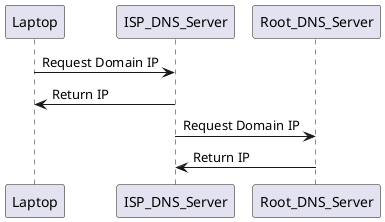

# Scalability

**Contents**:

[[toc]]

## Resources

- https://github.com/donnemartin/system-design-primer
- https://www.youtube.com/watch?v=-W9F__D3oY4

## Definitions

**Performance**: usually refers to systems speed for a single user

**Scalability**: usually refers to systems speed under heavy load.

**Latency**: the time to produce a result.

**Throughput**: the number of results per unit of time.

## CAP Theorem

We can only support 2 of these distributed systems, one of which **must** always be *partition tolerance*:

**Consistency**: every request receives the most recent write

**Availability**: every request receives a response, without guarantee of the most recent version of the data

**Partition Tolerance**: partition refers to a communication break within a distributed system, tolerance means the cluster must continue to work despite breakdowns between nodes in the system

**CP**: good choice if the business requires atomic reads and writes.

**AP**: good choice if the business requires the system to continue working despite external errors.

### Consistency Patterns

**Weak Consistency**: After a write, reads may or may not return it (video chat, MMORPGs etc.)

**Eventual Consistency**: After a write, reads will see it eventually, data is replicated async (DNS, email etc.)

**Strong Consistency**: After a write, reads will see it, data is replicated sync (Postgres etc.)

### Availability Patterns

**High Availability (HA)**: ability of a system to operate continuously without failing for a designated period of time.

Availability is measured as a percentage of uptime and defines the proportion of time that a system is functional and working.

HA is the goal and there are two main patterns to achieve this:

**Fail-Over Active-Passive AKA Master-Slave**: heartbeats are sent between servers from active to passive. If hearbeat fails then the passive becomes the active server.

**Fail-Over Active-Active AKA Master-Master**: both servers manage traffic spreading the load between them.

Quantified by service uptime as a percentage with 99.9% (three 9s) being a minimum target.


## Domain Name System (DNS)

Translates a domain name (`www.google.com`) into an IP address (173.194.115.96)

Below is how the request for a domain name is handled with each system having a possible cache layer so the requests are not constantly made.

Browsers usually use a TTL cache.



CloudFlare, Googles 8.8.8.8 and OpenDNS are examples of managed DNS services.

DNS services are susceptible to DDoS attacks.


## Content Delivery Network (CDN)

A globally distributed network of proxy servers, serving content closer to the user.

Generally static files such as HTML/CSS/JS/ or media content are served from CDN.

The sites DNS resolution will tell clients which server to contact.

**Advantages**:
- user gets content faster as the data center selected is the closest to them
- your app server does not have to serve the requests the CDN fulfils.

**Disadvantages**:
- content might be stale if it is updated before the TTL expires it
- expensive so have to carefully consider cost effectiveness
- another point of failure, but it is out of your control

AWS CloudFront is a CDN that is often used.

### Types

**Push CDNs**: receive new content whenever changes occur on your server.

Advantages:
- you determine when content is delivered to CDN and when it expires
- efficient as CDNs are more up-to-date so less requests to app server

Disadvantages:
- high storage consumption
- requires detailed configuration

**Pull CDNs**: grab new content from your server when the first user requests the content.

Advantages:
- CDN does most of the work
- minimises storage consumption

Disadvantages:
- slower for first visitors

Push is more expensive (more data being transferred, increase amount stored on CDN) but ensures CDNs are kept up to data, pull is less expensive but can serve outdated content


## Load Balancer

Public servers of a scalable web service are hidden behind a load balancer.  This load balancer evenly distributes load (requests from your users) onto your group/cluster of  application servers. That means that if, for example, user Steve interacts with your service, he may be served at his first request by server 2, then with his second request by server 9 and then maybe again by server 2 on his third request. 

Every server contains exactly the same codebase and does not store any user-related data, like sessions or profile pictures, on local disc or memory. 

Sessions need to be stored in a centralized data store which is accessible to all your application servers. It can be an external database or an external persistent cache, like Redis. An external persistent cache will have better performance than an external database. By external I mean that the data store does not reside on the application servers. Instead, it is somewhere in or near the data center of your application servers. 

This pattern is called horizontal scaling.

### Simple Explanation

The load balancer takes a request from a client and decides which server should receive this request.

```
              -------------
client1 ---> |load balancer| ----> server2
             |             |
client2 ---> |             | ----> server1
              -------------
```

There are many ways to do this

### Round Robin

Iterate through all the servers ip addresses sequentially for each request.

e.g. request 1 goes to server1, request 2 goes to server2, request 3 goes to server1 etc.

To implement this properly we need to use caching to ensure that cpu intensive tasks are not done over and over again.


Session data is stored on a separate server or RAID so we can share state across all the servers.

Session data could be stored on a shared database that all servers will have access to.


RAID (specifically RAID1) is essentially having multiple HDDs storing the exact same data such that if one HDD fails, your data is not lost.

Any lost data is then copied back to the other drive.

There is multiple forms of RAID.


### LB Replication

Replication of load balancers is possible through various toolings

active:passive LB; duplicated LB's whereby the if the active LB breaks we promote the passive LB to active (takes over active IP address)

active:active LB; 2 LB's constantly working independently parsing packets to the web servers

Both are highly available.

High availability (HA); paradigm that eliminates single points of failure to ensure continuous operations of uptime for an extended period.


## Databases

Taken from [here](https://www.lecloud.net/post/7994751381/scalability-for-dummies-part-2-database)

Databases can be a bottle neck. To scale this there are two options.

### Solution one

First is to perform a master slave replication whereby the slave db servers are for write only and the single master server is used for writing. The master server will require significant vertical scaling (especially RAM upgrades).

If there are still issues the master server can be sharded which is a horizontal partition of rows of data across multiple database servers. Sharding can be based on something like EU customers vs US customers.

This can reduce index size & individual server load.

The issue with sharding is it results in a reliance on the interconnection between the servers and increases query latency (when more than one shard needs to be searched). Cross shard consistency and durability is very challenging and there can no guarantee of adherence.

### Solution Two

Denormalise data from the beginning and disallow join queries in the database. Instead make all joins occur at the application code level.

If you are doing that then perhaps using a NoSQL database would be better to use after all..

### Data Loss Prevention

Replication of databases is possible to mitigate data loss

This can have multiple slaves (completely different servers) where they essentially store a copy of the master database. That way 3 slave databases will contain the exact same data as master.

If anything goes wrong its fine as we have multiple replicants of master.

To be more efficient in sites that are especially read heavy, we can designate some database replicants as read only (slaves) and master are for write operations only. However, this gives a single point of failure for writing to databases

We can use another paradigm where there are 2 masters (for writing operations) each with their own slave (for read operations). Both masters then get a copy of the operation of the which other received. Thereby keeping both masters in sync. Slaves get a copy from their masters.

This second approach is more HA as we will always have master available to use.

We can use a load balancer to direct to slave databases (does not matter which one as only reading)

```
database master slave paradigm

                      ┌─────┐
                      │     │
                      │ LB  │
                      │     │
    ┌─────────┬───────┴──┬──┴────────┬─────────┐
    │         │          │           │         │
    │         │          │           │         │
    │         │          │           │         │
    │         │          │           │         │
┌───▼───┐  ┌──▼────┐  ┌──▼────┐  ┌───▼───┐ ┌───▼───┐
│       │  │       │  │       │  │       │ │       │
│server │  │server │  │server │  │server │ │server │
│       │  │       │  │       │  │       │ │       │
└────┬──┘  └───┬───┘  └───┬───┘  └───┬───┘ └────┬──┘
     │         │          │          │          │
     ├─────────┴──────────┴──────────┴──────────┤
     │                                          │
     │Read Queries                    Write Queries
     │                                          │
     │ ┌────┐                                   │
     └─► LB │                                   │
       └─┬──┘                                   │
         │                                      │
    ┌────┴─────┬──────────┐                     │
    │          │          │                     │
┌───▼────┐ ┌───▼────┐ ┌───▼────┐                │
│        │ │        │ │        │                │
│PS slave│ │PS slave│ │PS slave│                │
│        │ │        │ │        │                │
└───▲────┘ └────▲───┘ └───▲────┘                │
    │           │         │                     │
    │           │         │          ┌──────────▼┐
    └───────────┴─────────┴──────────┤ PS Master │
              Replication            └───────────┘
```


### Optimisation Techniques

#### Denormalisation

Denormalisation is the process of trying to increase the read performance of a database, at the expense of losing some write performance by adding redundant copies of data of by group data.

An [example](https://stackoverflow.com/questions/59059327/a-practical-example-of-denormalization-in-a-sql-database) is to merge two tables into one table so joins are no longer required to query all the necessary data.

Ultimately there are three types of denormalisation:
  - combine tables together so you don't have to perform joins
  - perform aggregate calculations (sum(), count() etc.) so you don't have to use GROUP BY
  - pre-calculate expensive calculations so you don't have to use queries with complex expressions

The negatives of denormalisation is that the pre-calculated data may be out dated if data was added/deleted/changed to the normalised table but the corresponding denormalised table pre-calculated data was not updated. Data is not inconsistent and incorrect.


#### Partitioning

[Explained](https://www.singlestore.com/blog/database-sharding-vs-partitioning-whats-the-difference/)

The process of dividing a very large table into multiple smaller individual tables. This results in faster queries as there is less data to scan. The aim is to reduce to overall read response time for SQL operations.

Vertical partitioning is splitting table by columns and connecting to the two table rows by a common id.

You should consider partitioning when:

- the table becomes greater than 2Gb
- table containing historical data only which will never be updated

#### Sharding

[Explained](https://www.singlestore.com/blog/database-sharding-vs-partitioning-whats-the-difference/)

A form of Horizontal partitioning where a tables rows are split up across multiple database servers. Sharding can be based on something like EU customers vs US customers.

Advantages:

- Reduces index size
- Distribute the database across servers thereby improving performance
- Segment data by geography


Disadvantages:

- SQL code becomes more complex
- Multiple points of failure within the now interconnected system
- Single point of failure; corruption of one shard causes failure of the entire table
- Backing up becomes complex; back up of shards must be co-ordinated
- Operational complexity; adding indexes or columns, modifying schema becomes much more difficult


## Caching

### In Memory Caching

In memory caches like Redis are key value stores that should be separated from your application layer.

All data is stored in RAM and is therefore very fast. We should always be checking cache first before retrieve data from a database.

There are two major cache patterns that are used:

Cached Database Queries; the database query results are stored in the cache with the key being the query itself.

Cached Objects; store the complete instance of an object into the cache (I guess in conjunction with the `pickle` lib)

The cached objects approach means we write to the cache anytime the object changes, using an id to track the object itself (key for the object in the cache).

#### Cache-Aside

The most common used caching approach.

The application is responsible for reading and writing to both the cache and database.

The cache is kept "aside" as a faster and more scalable data store, but is not utilised as the primary data store.

1. Application checks the cache, if found we have a hit and return it.
2. If cache miss, the application get the data from the database, store it in the cache and return it.

**Pros**:

- great when using read-heavy workloads
- if Redis goes down then the system still works as the application will simply go to the database instead

**Cons**:

- Can be out of sync with the database even when implementing a TTL

Work around is to invalidate the cache and update it anytime there is a database entry update. Although, this requires some work to implement.

#### Read-Through & Write-Through Caching

This is where the application treats the cache as the main data store by reading and writing data to it.

So the application code does not interact with the database.

It is the caches responsibility to update the database.

In write-through, data is simultaneously updated to cache and memory.

Read Through:
1. Application checks the cache.
2. Cache returns it if available, else cache gets it from the database, stores it in itself then returns it to the application

Write Through:
1. Application writes to the cache
2. Cache writes to the database


**Pros**

- simplifies application code, as the cache takes care of maintaining the database entries.
- much better data consistency guarantee 
- data in cache is *always* up to date.
- simplifies the overall system design

**Cons**

- if the cache fails we cannot access data from the database directly; we have a new single point of failure
- writing to the cache & database every time adds latency and server cost.

Best method to use when data consistency is absolutely essential.

#### Read Through & Write Back Caching

Cache is responsible for both reading and writing from the database.

Write back is a storage method in which data is written into the cache every time a change occurs, but is written into the corresponding location in main memory only at specified intervals or under certain conditions.

Essentially there is a delay before writing to the database.

**Pros**

- simplifies application code, as the cache takes care of maintaining the database entries.
- improve write performance compared to Write Through method (better for latency and cost)

**Cons**

- if the cache fails we cannot access data from the database directly; we have a new single point of failure
- delay to writing to the database means there is a risk of data loss if the cache goes down


DAX in AWS utilises this method.


### LRU Caching

This is not suitable for storing any objects that will be used across multiple applications servers e.g. session data.

Essentially caching the function response against the args as a key in a dict.

Example, suitable for caching request responses that never change.
